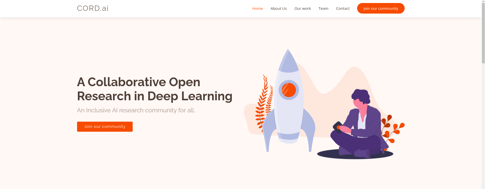

# **CORD.ai Website**

This is the official website of CORD.ai. Please contribute to the website by solving the issues posted by the team. 

## **Contributing**

Please head over to the issues tab to get started with contributing to the website. This is how we expect you to contribute to the website.

1. Fork the website.
2. Go to the issues tab and take one issue at a time and discuss that issue with the repo maintainers. 
3. Maintainers will be assigning that issues to you. 
4. Clone the repo and create your branch. The format must be `<your Name>/<feature name>`. For e.g. Suppose a person named Sam is trying to create dark mode to the website then the branch name must be: `Sam/Website-darkmode`. 

5. Commit your changes. We have hosted our website in netlify. So once your PR gets merged to our main branch, you will be seeing the changes to the main site. Netlify automatically has its own CI/CD pipeline. So no need to worry about deployement stuffs. 

---

## **Website Roadmap**
### **Phase 0**

1. [x] Completed the initial website.

### **Phase 1**

1. [ ] Add a CORD.ai icon.
2. [x] Add the required names, credentials and socials links of each of the core team members. 
3. [ ] Add new projects and group them based on `projects`, `blogs` and `sessions`. 
4. [ ] Have a initial backend by changing the PHP files to enable the mailing services. 
5. [ ] Adding a form in the `join community` button that will redirect to slack community once form submitted successfully. 

### **Phase 2**

1. [ ] Solve the left over issues. 
2. [ ] Completely change the backend to either `jekyll` or `react`.
3. [ ] Have a proper database of the members and the works that have been done on the community. 
